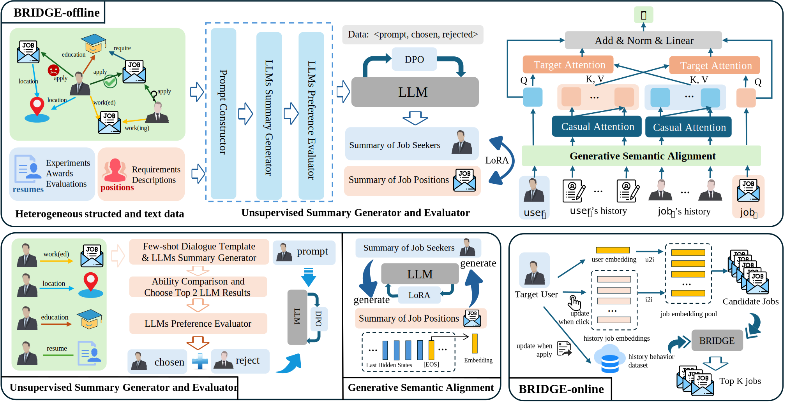

# BRIDGE

Official PyTorch implementation for **B**ehavio**R** **I**nsights **D**riven job recommendation with **G**enerative **E**mbeddings (BRIDGE) framework

## Model Overview




## Requirements

```
pytorch==2.2.0
modelscope==1.9.5
transformers>=4.40.0
peft==0.7.0
datasets
safetensors
streamlit
sentencepiece
accelerate
flash_attn==2.5.3+cu118
vllm
tqdm
scikit-learn
```


## Quick Start

- LLMs summary generator

```shell
# edit your few-shot learning prompt
python modules/generator/inference.py
```

- LLMs summary evaluator

```shell
# edit yor CoT-based prompt
python modules/generator/inference.py

# fintune your prefence dataset with dpo
python modules/generator/dpo.py
```

- LLMs generative semantic alignment

```shell
# finetune your dataset with lora
python modules/generator/lora.py

# get [EOS] token embeddings
python modules/generator/embedding.py
```

- Person-job matching training

```shell
# edit run_main.sh with yor hyperparameter
sh modules/matching/run_main.sh
```

## Datasets

Due to the highly sensitive nature of personal resume information and the data confidentiality agreement signed between the researchers of this paper and the relevant enterprise, the data portion cannot be disclosed to the public. 

Nevertheless, this study will provide dataset examples, allowing subsequent researchers to utilize their own acquired data to conduct research.